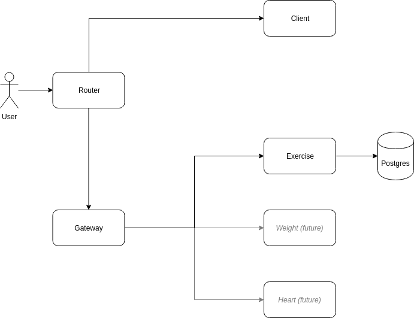
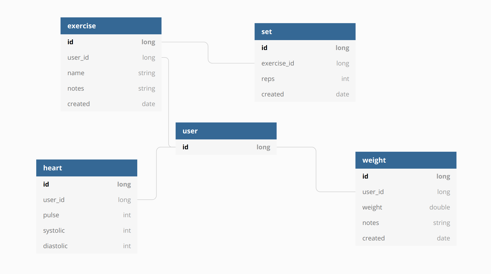

# Beefy Gainz

## Related Repositories

All related repositories are named `beefy-gainz-{service name}`.

[beefy-gainz-client](https://github.com/azsuth/beefy-gainz-client)

[beefy-gainz-gateway](https://github.com/azsuth/beefy-gainz-gateway) 

[beefy-gainz-router](https://github.com/azsuth/beefy-gainz-router) [](https://travis-ci.org/azsuth/beefy-gainz-router)

[beefy-gainz-exercise](https://github.com/azsuth/beefy-gainz-exercise) [](https://travis-ci.org/azsuth/beefy-gainz-exercise)

## Setup

Install `meta` globally.

```npm i -g meta```

Clone the meta repo.

```meta git clone https://github.com/azsuth/beefy-gainz.git```

## Running Locally

`docker` and `docker-compose` are required for running locally.

In the root `/beefy-gainz` repo, run `docker-compose up -d` to start all the services. The `Gateway` and `Client` applications will live reload without needing to be restarted (the browser will need to be refreshed when client code is changed).

An `idToken` header is necessary to authenticate with the backend APIs. Upon logging in with Google, the `idToken` is printed to the `Gateway` logs and can be obtained with `docker-compose logs -f gateway`. This can then be used with Postman for subsequent requests.

The client code is hosted at `http://localhost:3001`. The APIs are hosted behind `http://localhost:3001/api`, for example `GET http://localhost:3001/api/exercises` will return a list of exercises.

## Services



### Gateway

Node app that validates a google token ID. Provides simple, unauthenticated passthrough for all base routes. Authenticates routes beginning with `/api`. All traffic is passed to the router.

### Router

Nginx reverse proxy server.

### Client

Client web code.

### Exercise

Service providing CRUD operations for Exercises and Sets

## Data

